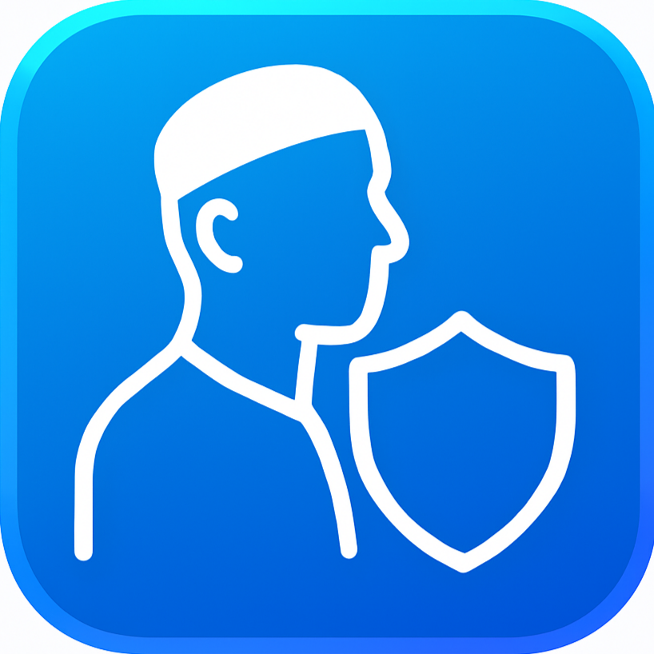

🌐 العربية | [English](README_EN.md)

# تطبيق Haram Block 🛡️


<div align="center">
  
</div>

## مقدمة
تطبيق **Haram Block** هو تطبيق مبتكر يهدف إلى حماية المستخدمين من رؤية الصور غير اللائقة (التي تحتوي على وجوه نساء) من خلال تقنية التشويش (blur) أو الحجب. التطبيق مستوحى من فكرة إضافة **Haram Blur**، ويستخدم تقنيات الذكاء الاصطناعي لتحقيق هذا الهدف بكفاءة عالية على الهواتف الذكية.

يهدف التطبيق إلى توفير بيئة آمنة أثناء تصفح الإنترنت أو استخدام التطبيقات، مع الحفاظ على الأداء العالي واستهلاك منخفض للبطارية. يعتمد التطبيق على تقنيات متقدمة مثل اكتشاف الوجوه وتصنيف الجنس، مع واجهة سهلة الاستخدام.

## الفهرس 📑
- [كيفية تثبيت التطبيق (كمستخدم عادي)](#كيفية-تثبيت-التطبيق-كمستخدم-عادي)
- [كيفية تثبيت التطبيق (كمبرمج)](#كيفية-تثبيت-التطبيق-كمبرمج)
- [كيف يعمل التطبيق](#كيف-يعمل-التطبيق)
- [اقتراحات للتطوير والتحسين](#اقتراحات-للتطوير-والتحسين)
- [دعوة للمساهمة](#دعوة-للمساهمة)

---

## كيفية تثبيت التطبيق (كمستخدم عادي)
لتثبيت تطبيق **Haram Block** كمستخدم عادي، اتبع الخطوات التالية:
1. قم بتنزيل ملف الـ APK من [هذا الرابط](https://example.com/haram-block-apk).
2. افتح ملف الـ APK على جهازك الأندرويد.
3. قم بالموافقة على التثبيت من مصادر غير معروفة إذا لزم الأمر (يمكن تفعيل هذا الخيار من إعدادات الأمان).
4. انتظر حتى يكتمل التثبيت، ثم افتح التطبيق واتبع التعليمات لتفعيل الخدمات المطلوبة (مثل Accessibility Service).

> **ملاحظة**: تأكد من أن جهازك يعمل بنظام أندرويد 7.0 أو أحدث لضمان التوافق.

---

## كيفية تثبيت التطبيق (كمبرمج)
إذا كنت مبرمجًا وترغب في تثبيت التطبيق أو المساهمة في تطويره، اتبع الخطوات التالية:
1. افتح الترمينال (Terminal) على جهازك.
2. انسخ الأوامر التالية لتحميل المشروع وإعداده:

```bash
git clone https://github.com/username/HaramBlock.git
cd HaramBlock
```

3. قم بتشغيل سكربت الإعداد المناسب لنظام التشغيل الخاص بك:
   - **لنظام Linux/macOS**:
     ```bash
     ./setup.sh
     ```
   - **لنظام Windows**:
     ```bash
     .\setup.bat
     ```

4. تأكد من تثبيت المتطلبات الأساسية:
   - **JDK 17** (Java Development Kit).
   - **Android SDK** (يمكن تثبيته عبر Android Studio).
   - أدوات بناء مثل Gradle.

> **ملاحظة**: عملية الإعداد قد تستغرق وقتًا إذا لم يكن لديك JDK 17 أو Android SDK مثبتين مسبقًا. تأكد من تثبيتهما قبل تشغيل السكربت.

---

## كيف يعمل التطبيق
يعتمد تطبيق **Haram Block** على سلسلة من المراحل التقنية لتحقيق وظيفته. فيما يلي نظرة عامة على آلية العمل مع رسم تخطيطي:

```
📱 Accessibility Service
        ↓
📸 Media Projection (Screen Capture)
        ↓
🔄 JNI (C++) + NCNN Framework
        ↓
🖼️ Image Preprocessing
        ↓
😊 Face Detection (Slim-128 Model)
        ↓
👩‍🦰 Gender Classification (Custom Model)
        ↓
🛑 Block Inappropriate Images
```

### 1. **Accessibility Service**
يستخدم التطبيق خدمة الوصول (Accessibility Service) لاكتشاف إطارات الصور المعروضة على الشاشة. يتم جمع إحداثيات هذه الإطارات لتحديد مواقع الصور بدقة. يتم استخدام تقنيات التخزين المؤقت (Caching) لتقليل المعالجة المتكررة لنفس الصور، مما يحسن الأداء.

### 2. **Media Projection**
تقنية **Media Projection** تتيح للتطبيق التقاط لقطات شاشة (Screenshots) بشكل آمن. يتم استخدام إحداثيات الإطارات التي تم جمعها من Accessibility Service لاقتصاص الصور المطلوبة من الشاشة.

### 3. **JNI + NCNN**
- **JNI (Java Native Interface)**: يسمح بتشغيل مكتبات C++ داخل تطبيقات Java، مما يتيح استخدام مكتبات متقدمة مثل NCNN.
- **NCNN**: مكتبة خفيفة الوزن ومُحسّنة لمعالجات ARM، تُستخدم لتشغيل نماذج الذكاء الاصطناعي بسرعة وكفاءة على الأجهزة المحمولة.

### 4. **Image Preprocessing**
يتم تهيئة الصور المقصوصة لتكون جاهزة للمعالجة. تشمل هذه العملية ضبط حجم الصورة، تحسين جودتها، وإزالة التشويش غير الضروري.

### 5. **Face Detection**
يستخدم التطبيق نموذج **Slim-128** (مفتوح المصدر) لاكتشاف الوجوه في الصور. هذا النموذج خفيف للغاية (حوالي 1 ميجابايت) ويعمل بسرعة تتراوح بين **5-12 مللي ثانية** لكل صورة.

> **رابط النموذج**: [Slim-128 Face Detection](https://github.com/ultralight-face-detection).

### 6. **Gender Classification**
يستخدم نموذج مخصص تم تصميمه باستخدام **PyTorch** ثم تحويله إلى **NCNN** لتحديد جنس الوجه (ذكر/أنثى). النموذج خفيف وسريع جدًا، حيث يستغرق **0.3-1.5 مللي ثانية** لكل وجه.

> **رابط نماذج الذكاء الاصطناعي**: [AI Models](https://example.com/ai).

### 7. **Block Mechanism**
عند اكتشاف صورة غير لائقة، يتم رسم مربع أسود فوقها بدلاً من استخدام التشويش (Blur) لتقليل استهلاك الموارد. هذا يضمن تجربة مستخدم سلسة دون التأثير على أداء الجهاز.

---

## اقتراحات للتطوير والتحسين
نرحب بمساهمات المطورين لتحسين التطبيق! سيتم ذكر أي مساهم بشكل بارز في المشروع. فيما يلي قائمة المهام المقترحة:

- [ ] تحسين واجهة المستخدم (UI) لتكون أكثر جاذبية وسهولة في الاستخدام.
- [ ] إضافة ميزة "التطبيقات الآمنة" للسماح باستثناء تطبيقات معينة من المعالجة.
- [ ] إتاحة خيار اختيار نماذج ذكاء اصطناعي مختلفة بناءً على قوة الجهاز واستهلاك البطارية.
- [ ] إضافة تحليلات إحصائية لتتبع عدد الصور التي تم حجبها.
- [ ] تطوير نسخة لنظام iOS باستخدام مكتبة **MNN** لتحسين الأداء.
- [ ] تحسين استهلاك البطارية والذاكرة.
- [ ] تسريع خوارزميات اكتشاف الصور والرسم.
- [ ] تحسين دقة نماذج الذكاء الاصطناعي.
- [ ] إنشاء فيديو ترويجي للتطبيق (بدون موسيقى أو محتوى غير لائق).
- [ ] إعادة صياغة ملف الـ README ليشمل تفاصيل أكثر شمولاً.

---

## دعوة للمساهمة
ندعو جميع المطورين والمهتمين للمساهمة في تطوير تطبيق **Haram Block**. المساهمة في هذا المشروع ليست فقط فرصة لتطوير مهاراتك التقنية، بل أيضًا وسيلة لكسب الأجر والثواب من خلال تقديم أداة تساعد المستخدمين على الحفاظ على بيئة نقية وآمنة. انضم إلينا اليوم!
