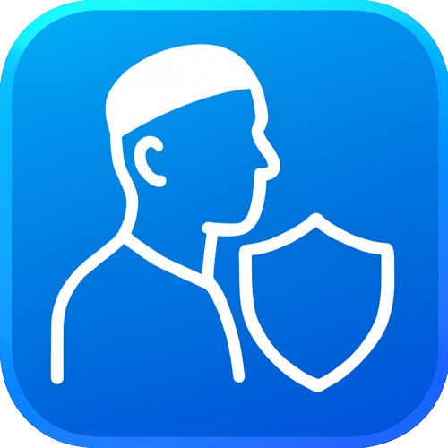

🌐 [العربية](/) | English

<div align="center">
  
</div>

# Haram Block App 🛡️
**Haram Block** is an innovative mobile application designed to protect users from viewing inappropriate images (those containing women's faces) by applying a blur or block effect. Inspired by the **Haram Blur** extension, this app leverages advanced AI techniques to deliver a seamless and efficient experience on smartphones.

The app aims to create a safe browsing environment while maintaining high performance and low battery consumption. It utilizes cutting-edge technologies such as face detection and gender classification, combined with an intuitive user interface.

## Table of Contents 📑
- [How to Install the App (as a Regular User)](#how-to-install-the-app-as-a-regular-user)
- [How to Install the App (as a Developer)](#how-to-install-the-app-as-a-developer)
- [How the App Works](#how-the-app-works)
- [Suggestions for Development and Improvement](#suggestions-for-development-and-improvement)
- [Call for Contributions](#call-for-contributions)

---

## How to Install the App (as a Regular User)
To install **Haram Block** as a regular user, follow these steps:
1. Download the APK file from [this link](https://example.com/haram-block-apk).
2. Open the APK file on your Android device.
3. If prompted, enable installation from unknown sources in your device’s security settings.
4. Complete the installation process and open the app to configure required permissions (e.g., Accessibility Service).

> **Note**: Ensure your device runs Android 7.0 or higher for compatibility.

---

## How to Install the App (as a Developer)
If you’re a developer looking to install or contribute to **Haram Block**, follow these steps:
1. Open a terminal on your system.
2. Run the following commands to clone and set up the project:

```bash
git clone https://github.com/username/HaramBlock.git
cd HaramBlock
```

3. Execute the setup script for your operating system:
   - **For Linux/macOS**:
     ```bash
     ./setup.sh
     ```
   - **For Windows**:
     ```bash
     .\setup.bat
     ```

4. Ensure the following prerequisites are installed:
   - **JDK 17** (Java Development Kit).
   - **Android SDK** (available through Android Studio).
   - Build tools like Gradle.

> **Note**: The setup process may take time if JDK 17 or Android SDK is not already installed. Ensure these are set up before running the script.

---

## How the App Works
**Haram Block** operates through a series of technical stages to achieve its functionality. Below is an overview with a visual representation:

```
📱 Accessibility Service
        ↓
📸 Media Projection (Screen Capture)
        ↓
🔄 JNI (C++) + NCNN Framework
        ↓
🖼️ Image Preprocessing
        ↓
😊 Face Detection (Slim-128 Model)
        ↓
👩‍🦰 Gender Classification (Custom Model)
        ↓
🛑 Block Inappropriate Images
```

### 1. **Accessibility Service**
The app uses the **Accessibility Service** to detect the coordinates of image frames displayed on the screen. These coordinates are used to identify images for further processing. Caching techniques are employed to avoid redundant processing, improving performance.

### 2. **Media Projection**
The **Media Projection** API allows the app to capture screenshots securely. Using the coordinates from the Accessibility Service, the app crops relevant image frames from the screen.

### 3. **JNI + NCNN**
- **JNI (Java Native Interface)**: Enables the integration of C++ libraries within Java-based Android apps, facilitating the use of advanced libraries like NCNN.
- **NCNN**: A lightweight, high-performance framework optimized for ARM processors, used to run AI models efficiently on mobile devices.

### 4. **Image Preprocessing**
Images are prepared for analysis by resizing, enhancing quality, and removing unnecessary noise, ensuring compatibility with AI models.

### 5. **Face Detection**
The app employs the **Slim-128** model (open-source) for face detection. This lightweight model (approximately 1 MB) processes images in **5-12 milliseconds**.

> **Model Link**: [Slim-128 Face Detection](https://github.com/ultralight-face-detection).

### 6. **Gender Classification**
A custom **PyTorch** model, converted to **NCNN**, is used to classify the gender of detected faces. It is highly optimized, processing each face in **0.3-1.5 milliseconds**.

> **AI Models Link**: [AI Models](https://example.com/ai).

### 7. **Block Mechanism**
Upon detecting an inappropriate image, the app draws a black rectangle over it instead of applying a blur effect to minimize resource usage, ensuring smooth performance.

---

## Suggestions for Development and Improvement
We welcome contributions from developers to enhance **Haram Block**! Contributors will be credited prominently in the project. Below is a to-do list of suggested improvements:

- [ ] Enhance the user interface (UI) for better usability and aesthetics.
- [ ] Add a "Safe Apps" feature to exclude specific apps from processing.
- [ ] Allow users to choose between AI models based on device performance and battery usage.
- [ ] Implement analytics to track the number of blocked images.
- [ ] Develop an iOS version using the **MNN** framework for optimal performance.
- [ ] Optimize battery and memory consumption.
- [ ] Improve the speed of image detection and rendering algorithms.
- [ ] Enhance the accuracy of AI models.
- [ ] Create a promotional video for the app (without music or inappropriate content).
- [ ] Rewrite the README file to include more comprehensive details.

---

## Call for Contributions
We invite all developers and enthusiasts to contribute to **Haram Block**. By improving this app, you’re not only honing your technical skills but also helping create a tool that promotes a safer digital environment. Join us today and make a meaningful impact!